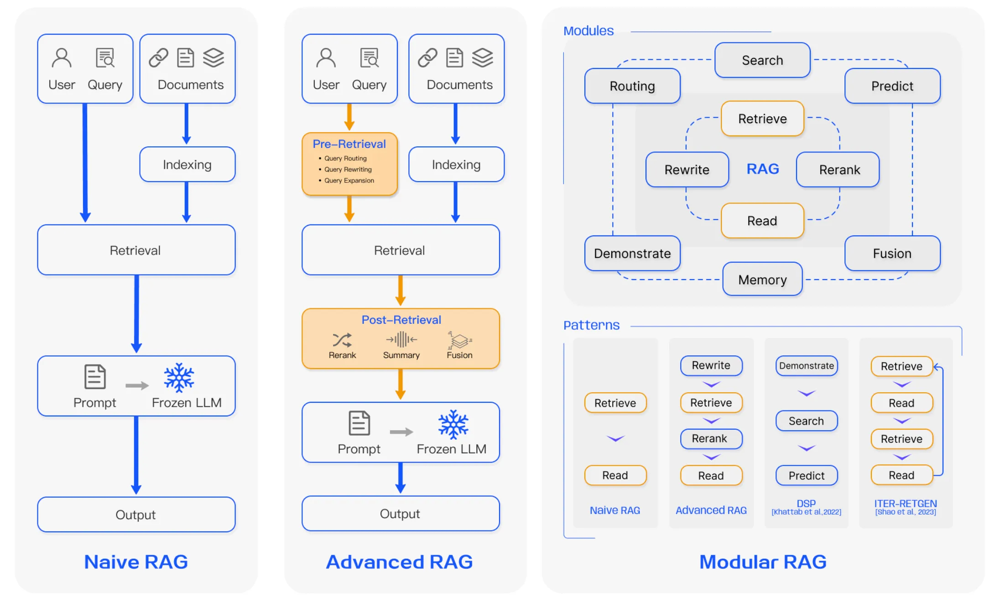
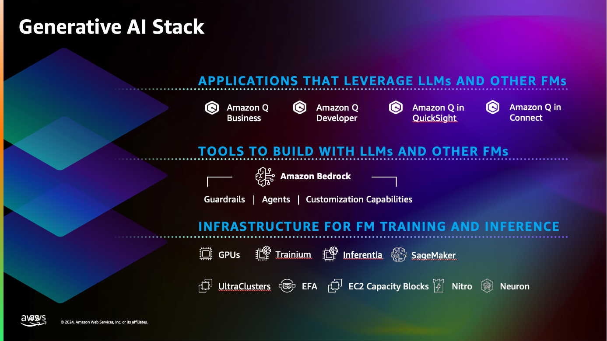

# AWS GenAI RAG Workshop

## Overview

In the rapidly evolving field of GenAI, Retrieval-Augmented Generation (RAG) has emerged as a 
standard pattern that combines the power of foundations models with the ability to retrieve and incorporate relevant 
information from external knowledge sources. This is crucial for generative AI use cases, where the AI system needs to 
generate coherent and factual responses that is grounded on your enterprise data.

But it's important to recognize that RAG not a one-size-fits-all approach. Within the RAG ecosystem, there are managed 
RAG solutions and custom RAG implementations. When considering a custom RAG approach, the level of customization needed 
can vary significantly, ranging from a naive RAG approach to more advanced and modular RAG implementations. The choice 
ultimately depends on the specific use cases and the desired business outcomes. 

|         |
|-----------------------------------------------------------------|
| Comparison between the three paradigms of RAG (Gao et al. 2024) |

In this workshop, you will explore different RAG options and design paradigms, developing knowledge and skills to 
optimize the performance and robustness of your RAG solution at an enterprise-level
scale. Simultaneously, you will delve deep into the AWS Generative AI stack, learning how you can leverage services 
like Amazon Kendra, Amazon Bedrock, and Amazon SageMaker to accelerate your generative AI journey.

## Managed RAG Workshop
We will begin by exploring Amazon Q, a managed RAG assistant service that simplifies the deployment and 
management of RAG systems. You will gain insights into the benefits of using a managed RAG solution and 
how it can accelerate your development process.

## Naive RAG Workshop
If you prefer to build a RAG solution on your own, you will learn how to build a Naive RAG quickly 
using Amazon Bedrock and Bedrock Knowledge base. You get a better understanding of the underlying components
that powers a simple RAG system.

## Advance RAG Workshop
As you progress to this workshop, you will experiment various RAG optimization techniques, harnessing the power of 
Amazon Bedrock and Amazon SageMaker. The workshop encompasses a comprehensive range of methodologies, guiding 
you from foundational data processing techniques (simple) to intermediate-level retrieval strategies, and finally
advanced fine-tuning approaches.

## Audience
The audience for this workshop are business users (Managed RAG Workshop Only), developers, data scientists, 
and AI enthusiasts who are interested in leveraging RAG for their generative AI use cases. Prior knowledge 
of AWS services and basic programming skills are recommended. 

The workshop is expected to take approximately **4 hours to complete**.

## Clean up 
Upon completing the workshop, users who use their own AWS account should remove the resources provisioned

